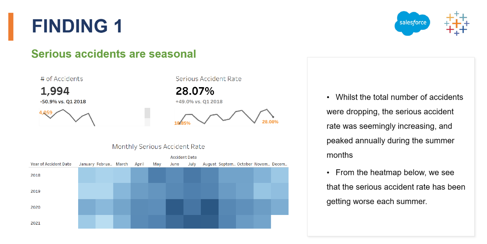
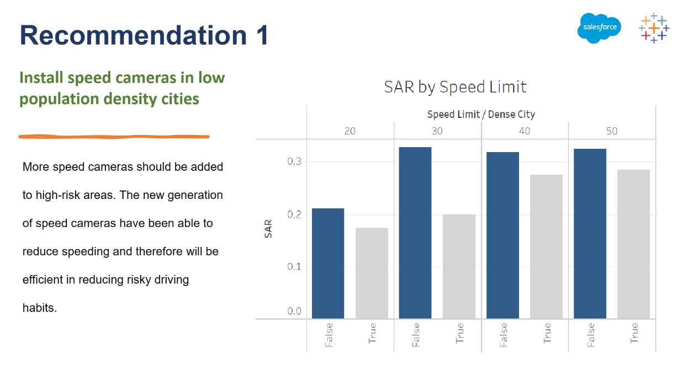

## Tableau Analytics Challenge by Aalto University & UTU
### Overview of the Challenge
- The Finnish Transport Infrastructure Agency, the Finnish Transport and Communications Agency, and local authorities of 10 biggest cities in Finland are working together to find new initiatives to improve road safety.
- While the overall trend of accidents has been improving during the past years, further improvements are sought after. The Finnish Transport Infrastructure Agency has been keeping track of these accidents and has produced a data set for the team of data analysts for further investigation of all traffic accidents from the past 4 years in Finland.
- The task is to use this data to produce data-driven insights that highlight the dangerous driving conditions, hazardous roads and other insights with impact to road safety, and present these back to project board

### Detailed Requirements 
The aim of this project is to produce data insights that help project board to understand the traffic safety 
problem areas and in particular:
  1. Identify the common issues in road safety including hazardous traffic conditions
  2. Reveal possible outliers among 10 biggest cities in finland
  3. How to reduce the number of accidents overall and especially serious accidents
### Short report of the results

